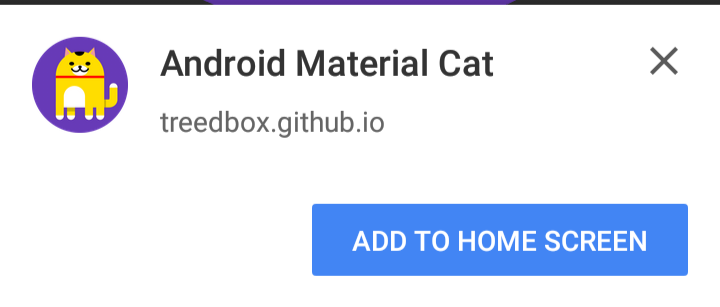
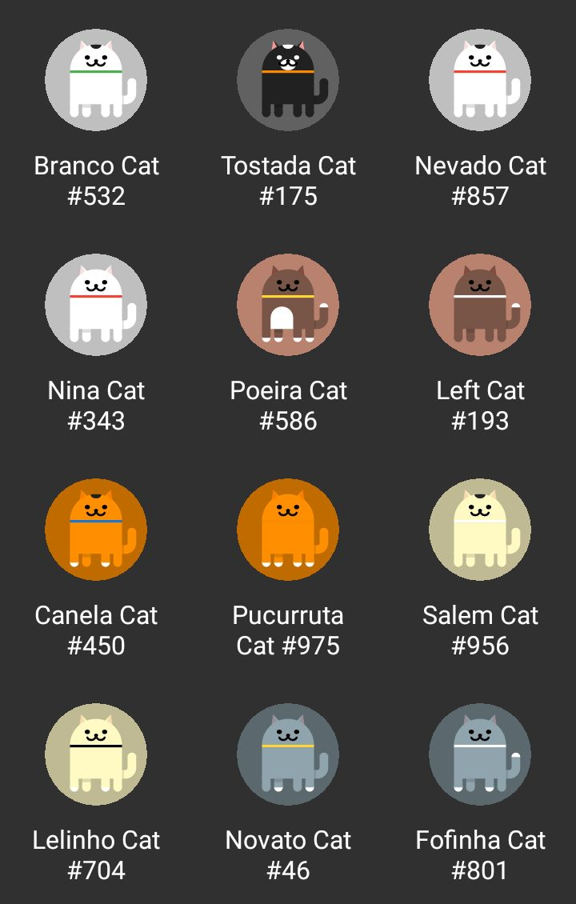

# Android Material Cat (PWA)
> Android Material Cat, Click on each cat part to random change color.
> PWA - Progressive Web App.

> Convert SVG to PNG

> Download as PNG or SVG

## Online Test
Android: Access from Google Chrome and Add this PWA to your Home Screen

[https://treedbox.github.io/android-material-cat/](https://treedbox.github.io/android-material-cat/ 'Android Material Cat')

## Click to Change Cat Color
* Click on each cat part to random change color

## Convert SVG to PNG
* Download your colored Cat as image (PNG) or SVG file.

## Android 7.0 Easter Egg
Based on a Android 7.0 Easter Egg called `Android Neko`

https://www.youtube.com/watch?v=U1NzniXruQo

## Import
#### Using `Treedbox Random Color`:

https://github.com/treedbox/treedbox-random-color

To apply random colors

#### Using `instantapp for Treedbox`:

https://github.com/treedbox/instantapp

To Turn this project in a Progressive Web App

## Tested
**Google Chrome 55**

**Firefox 50.1.0**

## Meta
Front-End Developer: [Jonimar Marques Policarpo](http://linkedin.com/in/treedbox 'LinkEdin')

Twitter: [@treedbox](http://twitter.com/treedbox)

E-mail: [treedbox@gmail.com](mailto:treedbox@gmail.com)

Site: [treedbox](http://treedbox.com)

## License
[MIT](LICENSE.md) © [TreedBox](https://github.com/treedbox)

[https://github.com/treedbox/android-material-cat](https://github.com/treedbox/android-material-cat)
